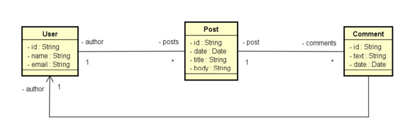

#  Projeto: Web Services com Spring Boot e MongoDB

Este projeto é uma aplicação web back-end desenvolvida durante o curso do **Prof. Nélio Alves (DevSuperior)**.  
O objetivo é construir uma API RESTful utilizando **Java com Spring Boot** e **MongoDB**, abordando conceitos como persistência de documentos, CRUD, consultas personalizadas, e uso de DTOs.

---

##  Objetivos

- Criar projeto Spring Boot com Java  
- Implementar modelo de domínio orientado a documentos  
- Estruturar as camadas do sistema (`domain`, `repository`, `service`, `resource`)  
- Conectar e configurar o banco de dados MongoDB  
- Povoar o banco com dados iniciais (instanciação)  
- Executar operações CRUD  
- Implementar DTOs para otimizar o tráfego de dados  
- Criar endpoints com filtros por texto e intervalo de datas  

---

##  Tecnologias Utilizadas

- Java 17  
- Spring Boot  
- Spring Data MongoDB  
- MongoDB  
- Maven  
- Postman  
- MongoDB Compass  

---

##  Funcionalidades

- Cadastro de usuários  
- Cadastro de posts (com título, corpo, data)  
- Associação de autor ao post usando `AuthorDTO`  
- Inclusão de comentários com `CommentDTO`  
- Consulta de posts por título  
- Consulta de posts por texto e intervalo de datas  
- Instanciação do banco de dados com dados iniciais  
- Tratamento de exceções personalizadas  

---
##  Domain Model



---

##  Camadas do Projeto

- **Domain (Entity):**  
  `User`, `Post`, `AuthorDTO`, `CommentDTO`
- **Repository:**  
  `UserRepository`, `PostRepository`
- **Service:**  
  Contém a lógica de negócio e chamadas aos repositórios
- **Resource (Controller):**  
  Responsável pelos endpoints da API REST
- **Config:**  
  Classe `Instantiation` para popular o banco na inicialização

---

##  Banco de Dados

- **MongoDB (local):**  
  Utilizado para armazenar os documentos do projeto
- **MongoDB Compass:**  
  Ferramenta para visualização e gerenciamento do banco
- **Coleções:**  
  `user`, `post`

---

##  Exemplo de Endpoint com Filtro

```http
GET http://localhost:8080/posts/fullsearch?text=Aproveite&minDate=2018-03-21&maxDate=2018-03-22
